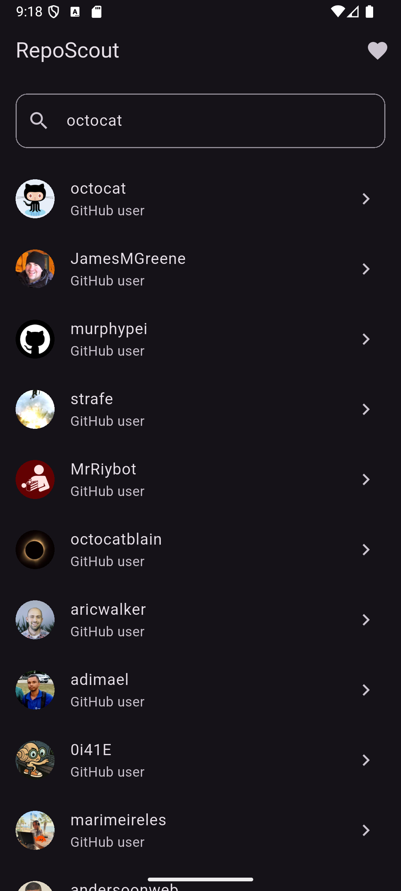
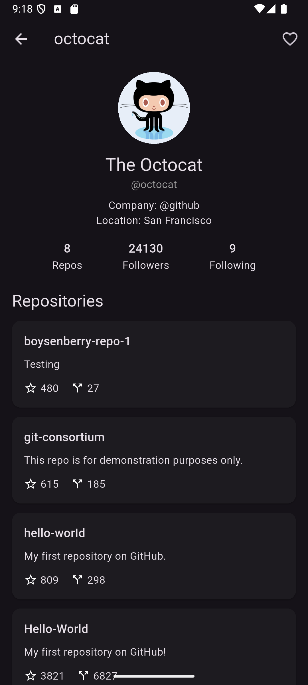
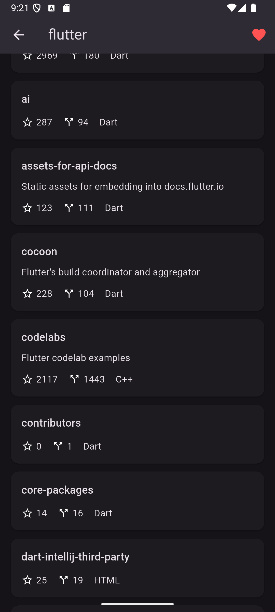
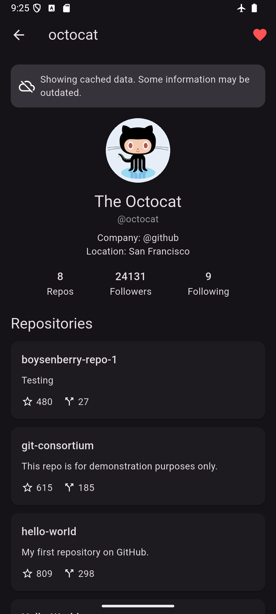
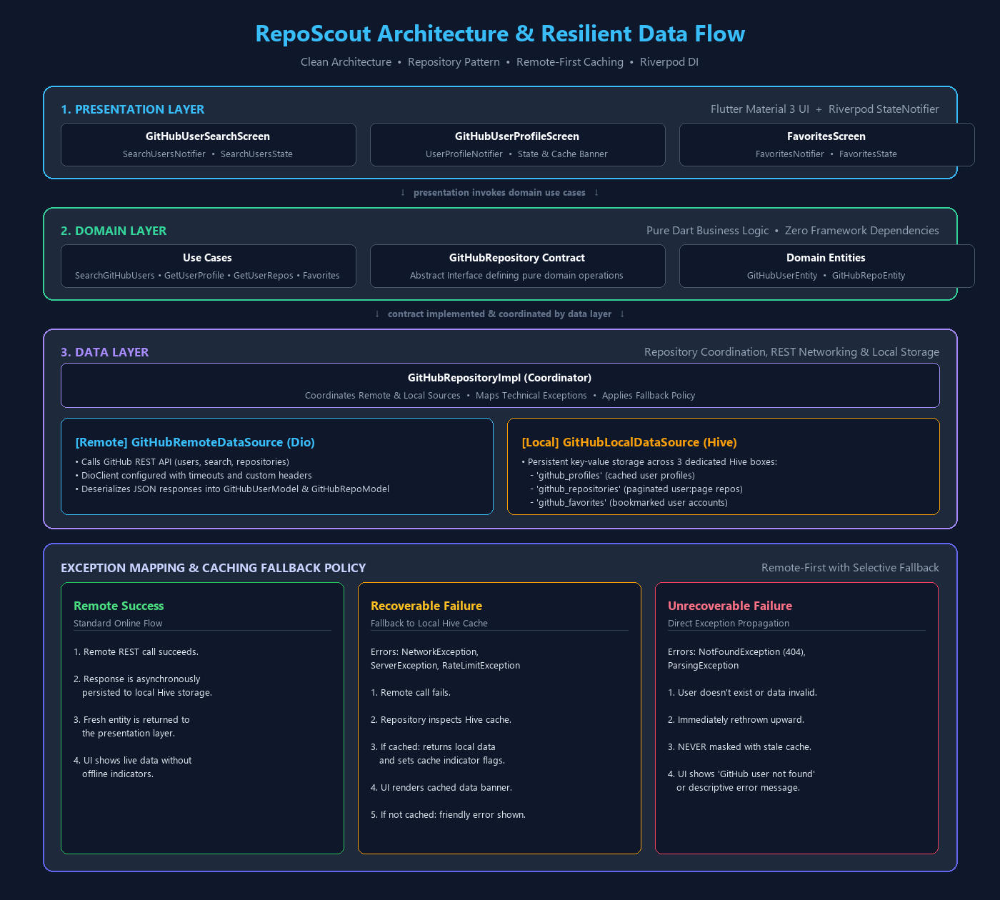

# RepoScout


A production-style Flutter GitHub explorer built to demonstrate clean architecture, resilient API integration, remote-first caching with offline fallback, local persistence, pagination, favorites, automated testing, and CI.

RepoScout lets users search GitHub profiles, inspect public repositories, save favorite users, and continue viewing previously cached data when connectivity is unavailable.

## Quick Demo

1. Search a GitHub username.
2. Open a profile.
3. Browse repositories.
4. Save the user to Favorites.
5. Reopen the profile while offline to see cached fallback behavior.

## Screenshots

| Search | Profile |
|---|---|
|  |  |

| Repositories | Favorites |
|---|---|
|  |  |

### Offline Cache



## Why This Project Exists

RepoScout is not intended to be a feature-heavy GitHub clone.

It was built as an engineering portfolio project focused on:

- maintainable Flutter architecture
- strict separation between domain, data, and presentation layers
- remote and local data source coordination
- graceful offline fallback
- predictable state management
- testable business logic
- CI-backed code quality

## Engineering Highlights

- Clean Architecture with domain, data, and presentation separation
- Repository Pattern with remote + local data source coordination
- GitHub REST API integration using Dio
- Riverpod dependency injection and reactive presentation state
- Remote-first caching with Hive offline fallback
- Paginated user search and repository loading
- Persistent favorites/bookmarks
- Explicit exception mapping and user-friendly errors
- Cached-data indicators for offline UX
- Unit and widget test coverage across repository and state layers
- GitHub Actions CI for analyze + test on every push and pull request

## Tech Stack

| Area | Technology |
|---|---|
| UI | Flutter |
| Language | Dart |
| State Management | Riverpod |
| Networking | Dio |
| API | GitHub REST API |
| Local Persistence | Hive |
| Architecture | Clean Architecture |
| Patterns | Repository Pattern, Dependency Injection |
| Testing | Flutter Test |
| CI | GitHub Actions |

## Architecture

RepoScout follows Clean Architecture principles, ensuring strict separation of concerns, testability, and independence from external frameworks:

```text
Presentation
    ↓
Use Cases
    ↓
Repository Contract
    ↓
Repository Implementation
   ↙              ↘
Remote             Local
Datasource         Datasource
   ↓                  ↓
  Dio                Hive
   ↓
GitHub API
```

- **Domain Layer**: Contains pure Dart business entities, repository contracts, and use cases with zero external framework dependencies.
- **Data Layer**: Implements repository contracts, orchestrating remote data fetching (Dio) and local persistence (Hive) with dedicated data models and exception handling.
- **Presentation Layer**: Built with Flutter and Riverpod (`StateNotifier`), providing reactive UI, clean state models, pagination triggers, and user-friendly error banners.

### Architecture Diagram



### Offline Strategy

RepoScout uses a remote-first caching strategy:

1. Requests are attempted against the GitHub REST API.
2. Successful profile and repository responses are cached locally using Hive.
3. Network, server, and rate-limit failures fall back to cached data when available.
4. `NotFoundException` and parsing failures are not masked by stale cache.
5. Connectivity status is used only for UX hints and never to bypass remote requests.

## Engineering Decisions

- **Why Clean Architecture**  
  Separates UI widgets, network infrastructure, storage mechanisms, and core business rules into distinct layers. This ensures business logic remains pure Dart without dependencies on Flutter or third-party packages, making features highly testable and refactorable.

- **Why Repository Pattern**  
  Coordinates remote and local data sources behind an abstract domain contract. The presentation and domain layers remain completely unaware of whether a response originated from Dio or Hive, preventing infrastructure leakage upward.

- **Why Remote-First Caching**  
  Prioritizes live, up-to-date GitHub data for developer queries while treating local cache as an automated resilience layer. When network drops or API rate limits are encountered, cached data seamlessly keeps the user workflow uninterrupted.

- **Why Hive**  
  Provides fast, lightweight, key-value storage that perfectly matches our need to store JSON-like profile objects, paginated repository pages, and user bookmarks without the overhead or migration complexity of a relational SQLite database.

- **Why Explicit Exception Mapping**  
  Distinguishes between recoverable and unrecoverable failures. Transient issues like network outages, server 5xx errors, and rate limits trigger cache fallback, whereas domain 404s (`NotFoundException`) and data parsing errors are propagated immediately to prevent masking invalid states with stale cache.

## Core Features & User Flows

- **User Search**: Query GitHub users with paginated REST API results.
- **User Profiles**: View avatar, bio, company, location, followers/following counts, and public repo counts.
- **Repository Exploration**: Browse paginated public repositories with stars, forks, language badges, and descriptions.
- **Persistent Favorites**: Save and bookmark GitHub users locally with immediate offline availability.
- **Resilient Offline Mode**: Previously viewed profiles and repository pages are automatically retrieved from Hive cache when network is unavailable.
- **Cached-Data Indicators**: Clear banner alerting users when cached data is being served.

## Getting Started

### Prerequisites

- Flutter SDK (stable channel)
- Dart SDK (>=3.0.0)

### Installation

1. Clone the repository:
   ```bash
   git clone https://github.com/Satti201/repo-scout.git
   cd repo_scout
   ```

2. Install dependencies:
   ```bash
   flutter pub get
   ```

3. Run the app:
   ```bash
   flutter run
   ```

## Testing

The project contains automated unit and widget tests covering:

- Local Hive caching
- Repository remote/local coordination
- Offline fallback
- Cache write behavior
- Exception propagation
- Favorite persistence
- Favorites state management
- Profile presentation state
- Pagination failure handling
- Basic widget rendering

Run:

```bash
flutter test
```

And:

```bash
flutter analyze
```

## What This Project Demonstrates

RepoScout demonstrates how I structure a Flutter application beyond UI implementation:

- converting requirements into architecture boundaries
- designing repository contracts
- separating API models from domain entities
- coordinating remote and local data sources
- implementing pagination and offline fallback
- isolating framework dependencies
- testing business and state logic
- maintaining code quality through CI

The same architecture can support Firebase, REST APIs, Supabase, or another backend without coupling the presentation layer to infrastructure details.

## Project Status

Core engineering implementation is complete.

Current focus:
- portfolio presentation
- screenshots/demo media
- documentation polish

The project intentionally avoids unnecessary feature expansion so the repository stays focused on architecture, reliability, and code quality.
